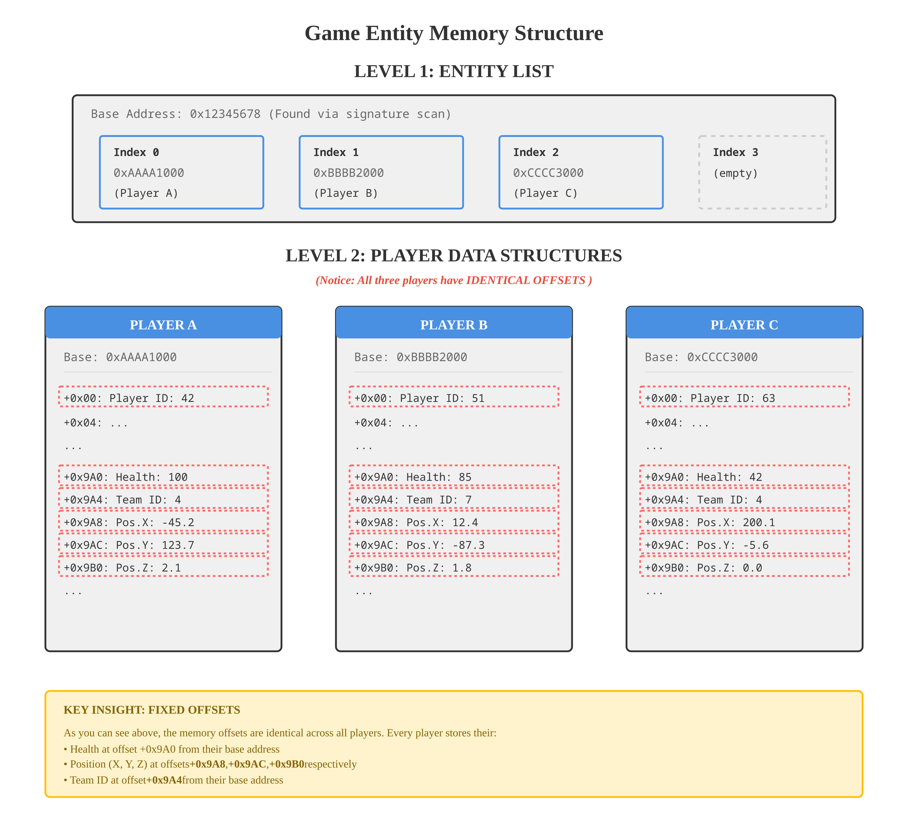

# 03: Game Data and Memory Offsets

Once an analysis tool is running inside the game's memory, its core task begins: finding and understanding the game's
data. This data isn't a chaotic mess; it's highly organized, and comprehending that organization is the key to reading
it.

## Game Data Structures: The Blueprint and the Houses

Games are built using Object-Oriented Programming (OOP). Every entity in the game—a player, a vehicle, a weapon—is an
"object." Each object is created from a C++ `class` or `struct`, which acts as its blueprint.

**Analogy: The Architect's Blueprint**

- A `Player` class is like an architect's blueprint for a house. The blueprint defines the layout: "The front door is at
  the start, a hallway extends 10 feet, the kitchen is at +10 feet, and the master bedroom is at +30 feet."
- Every time a new player joins the match, the game engine acts as a construction company, using the `Player` blueprint
  to build a new house in an empty lot in memory.
- Every house built from this blueprint has the exact same internal layout. The bedroom is always 30 feet from the front
  door. This consistency is what makes offsets work.

## Base Addresses and the Entity List: The Address Book

While every "house" (Player object) has the same internal layout, they are all built in different locations in memory.

- Each player object has its own unique **Base Address**. This is the "street address" of their house (e.g.,
  `0xAAAA1000`).
- The game needs a way to keep track of all the players in the match. It does this using a master list, commonly called
  the **Entity List**.
- This Entity List is not a list of the houses themselves, but a list of their street addresses. It's the **address
  book**. In C++ terms, it's a list of _pointers_ to the player objects (`std::vector<Player*>`).

When the analysis tool wants to find all the players, its first goal is to find this address book.

### Visualizing the Memory Layout: Two-Level System

Game memory uses a clever two-level structure to manage multiple players:

```
┌─────────────────────────────────────────────────────────────────────────┐
│                          LEVEL 1: THE ENTITY LIST                       │
│                                                                         │
│  Address: 0x12345678  (Found via signature scan - stable per session)   │
│  ┌─────────────────────────────────────────────────────────┐            │
│  │ Index 0 ──────► 0xAAAA1000 (Player A base address)      │            │
│  │ Index 1 ──────► 0xBBBB2000 (Player B base address)      │            │
│  │ Index 2 ──────► 0xCCCC3000 (Player C base address)      │            │
│  │ Index 3 ──────► (empty - slot for next player)          │            │
│  └──────┬──────────────────────┬──────────────────────┬────┘            │
│         │                      │                      │                 │
└─────────┼──────────────────────┼──────────────────────┼─────────────────┘
          │ Points to            │ Points to            │ Points to
          │                      │                      │
          ▼                      ▼                      ▼
┌──────────────────────┐ ┌──────────────────────┐ ┌──────────────────────┐
│ LEVEL 2: PLAYER A    │ │ LEVEL 2: PLAYER B    │ │ LEVEL 2: PLAYER C    │
│                      │ │                      │ │                      │
│ Base: 0xAAAA1000     │ │ Base: 0xBBBB2000     │ │ Base: 0xCCCC3000     │
├──────────────────────┤ ├──────────────────────┤ ├──────────────────────┤
│ +0x00: Player ID: 42 │ │ +0x00: Player ID: 51 │ │ +0x00: Player ID: 63 │
│ +0x04: ...           │ │ +0x04: ...           │ │ +0x04: ...           │
│ ...                  │ │ ...                  │ │ ...                  │
│ +0x9A0: Health: 100  │ │ +0x9A0: Health: 85   │ │ +0x9A0: Health: 42   │
│ +0x9A4: Team ID: 4   │ │ +0x9A4: Team ID: 7   │ │ +0x9A4: Team ID: 4   │
│ +0x9A8: Pos.X: -45.2 │ │ +0x9A8: Pos.X: 12.4  │ │ +0x9A8: Pos.X: 200.1 │
│ +0x9AC: Pos.Y: 123.7 │ │ +0x9AC: Pos.Y: -87.3 │ │ +0x9AC: Pos.Y: -5.6  │
│ +0x9B0: Pos.Z: 2.1   │ │ +0x9B0: Pos.Z: 1.8   │ │ +0x9B0: Pos.Z: 0.0   │
│ ...                  │ │ ...                  │ │ ...                  │
└──────────────────────┘ └──────────────────────┘ └──────────────────────┘
```

> **Visual Diagram:** For a clearer, mobile-friendly visualization of memory offsets:
> 
> 

#### Understanding Each Layer

**LEVEL 1 - Entity List (The Address Book):**

- **Fixed Location:** Found once at the start via signature scan
- **Purpose:** Stores pointers to all active player objects
- **Updates:** Changes when players join/leave the match
- **Access Pattern:** Read once per frame to get fresh player addresses

**LEVEL 2 - Player Objects (The Actual Data):**

- **Dynamic Addresses:** Each player's base address is different
- **Consistent Layout:** Every player object has identical internal structure
- **Static Offsets:** Health is always at base + 0x9A0
- **Read Pattern:** Used every frame with known offsets

## Offsets and Signatures: The Tools for the Treasure Hunt

A researcher needs two things to read a player's health: the base address of that player and the offset for health.

- **Offsets:** An offset is the distance, in bytes, from the base address of an object to one of its member variables.
  It's the "+30 feet" in the blueprint. The C++ compiler determines these offsets when the game is made. The job of the
  reverse engineer is to analyze the game's executable in Ghidra to re-discover these offsets.
  `Player's Health = Player_Base_Address + health_offset`.

- **Signatures:** Since the address of the Entity List changes every time the game starts, you need a reliable way to
  find it. You can't hardcode its address. However, the game's own code that accesses this list is static. A
  **signature** is a unique "fingerprint" or sequence of bytes from that code. Your tool can search the game's memory
  for this fingerprint. Once found, the code around the signature can be analyzed to reveal the location of the Entity
  List. This is a robust method because code fingerprints are less likely to change between game patches than data
  addresses.

---

## The Process in Action: Finding a Player

This is the practical, two-step process a tool uses to find the dynamic addresses of every player.

### Step 1: Find the "Address Book" (The Entity List) - Done Once

The first action the tool takes upon injection is to find the master Entity List.

1.  The tool comes with a pre-defined "signature" (a byte pattern) that corresponds to a piece of the game's code known
    to be near the Entity List.
2.  It scans the game's memory for this signature. This is a one-time, relatively heavy operation.
3.  Once it finds the signature, it performs a calculation based on the signature's location to get the current,
    real-time memory address of the Entity List.

This complex step is done only once when the tool loads. It now has the address of the "address book" for the rest of
the game session.

### Step 2: Read the "Addresses" from the "Address Book" - Done Every Frame

Now that the tool knows where the Entity List is, its main loop becomes very simple and fast. It no longer needs to scan
memory. Instead, it just reads the contents of the list.

The ESP's main loop continuously repeats the following:

1.  **Go to the known Entity List address.**
2.  **Read the list of pointers.** It iterates through the array, reading each entry.
    - The first entry is Player A's base address.
    - The second entry is Player B's base address.
    - ...and so on for every player in the match.
3.  **Store the fresh addresses.** At the end of the iteration, the tool has an up-to-date list of the exact base
    address for every active player.
4.  **Add offsets.** The tool then uses this list of base addresses, adding the static offsets to each one to read the
    final data (health, position, etc.).

### Summary Flowchart

```
[TOOL INJECTS]
      |
      V
[1. Signature Scan (Heavy Operation)] --> Finds address of Entity List.
(Done only ONCE per match)
      |
      V
[START OF MAIN ESP LOOP]
      |
      V
[2. Read Pointers from Entity List (Lightweight)] --> Gets a fresh list of all player base addresses.
      |
      V
[3. For Each Player Address...] --> Add offsets to read health, position, etc.
      |
      V
[4. Send data to Overlay for Drawing]
      |
      V
[Loop back to Step 2]
```
